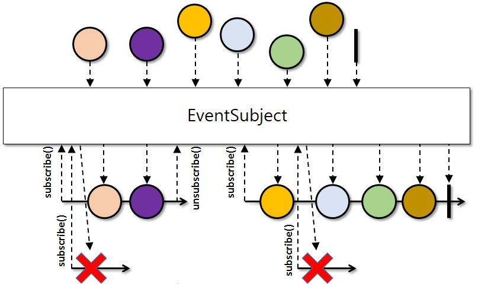

# EventSubject

A Subject similar to <a href="http://reactivex.io/RxJava/javadoc/io/reactivex/subjects/UnicastSubject.html">**UnicastSubject**</a>
in a sense that it allows only one <a href="http://reactivex.io/RxJava/javadoc/io/reactivex/Observer.html">**Observer**</a>
to be subscribed at a time but when the **Observer** is unsubscribed, another one is allowed to resubscribe to this subject again.

Just like **UnicastSubject** whenever no **Observer** is observing events, the events are queued up. Whenever a new **Observer**
subscribes to this, the queued up events are replayed and the queue subsequently emptied. While an **Observer** is subscribed
all emission are relayed to the **Observer** directly.

If more than one **Observer** attempts to subscribe to this **EventSubject** at the same time, they will receive an
**IllegalStateException**.

All other properties of this **EventSubject** are the same as of **UnicastSubject**.
